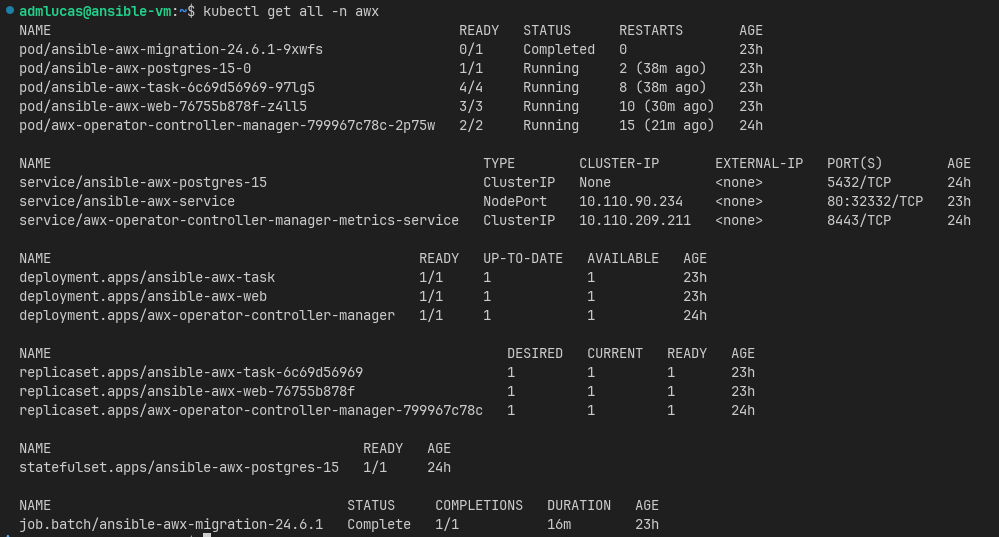
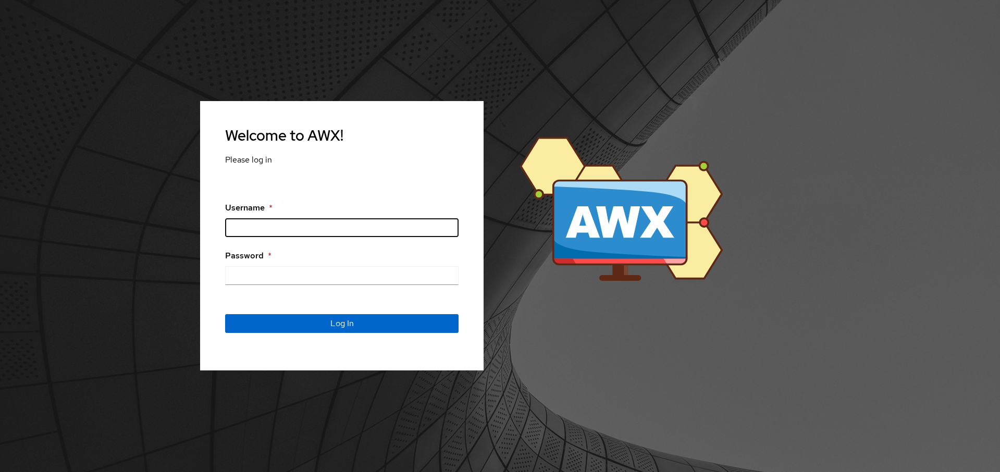
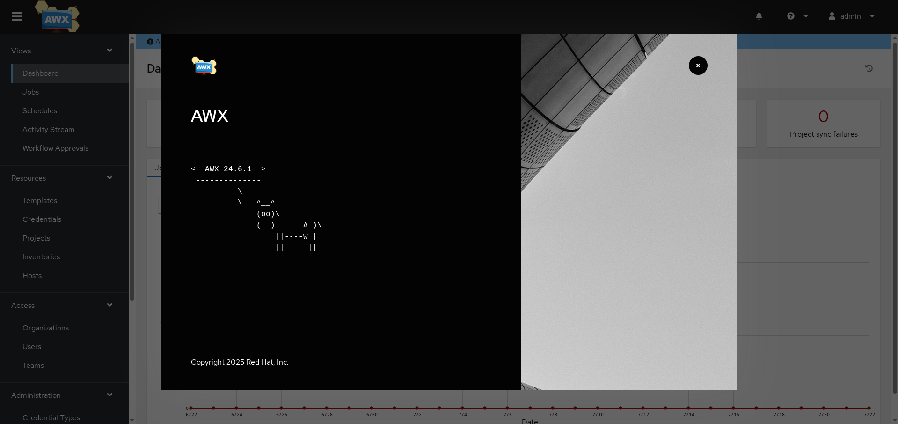

# Deploy Ansible AWX Operator

Esse repositório é para relatar a minha experiência na implantação do AWX Operator em uma VM Ubuntu Server 22.04.

## Configurações da VM
- Virtualizador: VirtualBox Machine
- VM:
    - 4 Gi RAM
    - 4 Processors
    - 120 Gb HD
    - Ubuntu Server 22.04
    - Bridge

## Pré-requisitos

- Docker
- Minikube
- Helm

## Instalação dos programas
Segui as documentações das tecnologias para realizar a instalação.

### Docker
[Docker](https://docs.docker.com/engine/install/ubuntu/#install-using-the-repository)
``` bash
# Add Docker's official GPG key:
sudo apt-get update
sudo apt-get install ca-certificates curl
sudo install -m 0755 -d /etc/apt/keyrings
sudo curl -fsSL https://download.docker.com/linux/ubuntu/gpg -o /etc/apt/keyrings/docker.asc
sudo chmod a+r /etc/apt/keyrings/docker.asc

# Add the repository to Apt sources:
echo \
  "deb [arch=$(dpkg --print-architecture) signed-by=/etc/apt/keyrings/docker.asc] https://download.docker.com/linux/ubuntu \
  $(. /etc/os-release && echo "${UBUNTU_CODENAME:-$VERSION_CODENAME}") stable" | \
  sudo tee /etc/apt/sources.list.d/docker.list > /dev/null
sudo apt-get update
```

``` bash
sudo apt-get install docker-ce docker-ce-cli containerd.io docker-buildx-plugin docker-compose-plugin
```

``` bash
docker version
docker compose version
```

> Entendi que não é necessário a instalação de todos os plugins, porém decidi fazer mesmo assim, simplificando o processo.

### Minikube
[Minikube](https://minikube.sigs.k8s.io/docs/start/?arch=%2Flinux%2Fx86-64%2Fstable%2Fdebian+package)
``` bash
curl -LO https://storage.googleapis.com/minikube/releases/latest/minikube_latest_amd64.deb
sudo dpkg -i minikube_latest_amd64.deb
```

### Helm
[Helm](https://helm.sh/docs/intro/install/#from-snap)
``` bash
sudo snap install helm --classic
```

### AWX Operator
[AWX Operator](https://ansible-community.github.io/awx-operator-helm/)
``` bash
helm repo add awx-operator https://ansible-community.github.io/awx-operator-helm/
helm install ansible-awx-operator awx-operator/awx-operator -n awx --create-namespace
```

## Comandos
``` bash
kubectl get secret ansible-awx-admin-password -o jsonpath="{.data.password}" -n awx | base64 --decode ; echo
```

## Processo
Tive alguns problemas para interpretar os arquivos yaml de configuração dos pods, pois eu não entendia a arquitetura e funcionamento da tecnologia. Logo, fui a busca de conhecimento.

Procurei artigos no Medium e vídeos no Youtube e consultas a mecanismos de IA generativa (ChatGPT e Copilot) para ter uma direção, o principal que tiver referencia foi o [Video](https://youtu.be/ftEiEfCk-PQ?si=_S3IB0Itw2yzXuur) e o [Artigo Medium](https://medium.com/@pavankumar.tadakaluru/setting-up-awx-ansible-opensource-ui-on-kubernetes-0e3936ec7bd4) como base. Eu já tenho noções de como funciona o Docker (Uso de Dockerfile, docker-compose, e comandos docker), redes e noção de IaC (Terraform Azure e AWS).

> Poderia ter lido a documentação, mas ir para a prática primeiro ajuda a ter uma visualização melhor do processo, irei me aprofudar posteriormente

### Criação da máquina virtual
Utilizei o VirtualBox Machine e configurei ela como na [Configurações da VM](./README.md#configurações-da-vm), sinto que preciso comprar realmente uma máquina mais potente para meus homelabs.

### VSCode RemoteHost
Na minha máquina Host, sendo possível fazer modificações de forma mais simplificada nos arquivos e rodar os comandos.

### Criando o StorageClass
Entendo que é como se eu estivesse criando perfis diferentes, exemplo: Banco master e um slave, onde diferentes pods, terão bases semelhantes, porém podem comportar dados de formas diferentes.
``` yaml
apiVersion: storage.k8s.io/v1
kind: StorageClass
metadata:
  name: local-storage
  namespace: awx
provisioner: kubernetes.io/no-provisioner
volumeBindingMode: WaitForFirstConsumer
```

E rodei o comando:
``` bash
kubectl apply -f awxstorage-class.yaml
```

### Criando o PersistentVolume
Pelo o que compreendi, é um espaço que será reservado na VM para que os pods do cluster possam compartilhar dados. Reservando uma quantidade de espaço, quais são as ações que podem ser feitas e declarando onde será este espaço.
``` yaml
apiVersion: v1
kind: PersistentVolume
metadata:
  name: postgres-pv
  namespace: awx
spec:
  capacity:
    storage: 10Gi                         # Aqui é informado a quantidade de armazenamento
  accessModes: ReadWriteOnce              # Neste caso é apenas escrita e leitura, não executando
  persistentVolumeReclaimPolicy: Retain
  storageClassName: local-storage
  hostPath:
    path: /mnt/storage                   # Interpretei que isso seria o similar dos volumes no docker
```

E rodei o comando:
``` bash
kubectl apply -f awx-pv.yaml
```

### Fazendo deploy do AnsibleAWX
Neste passo, comprendo que este é o meu arquivo que terá os componentes necessários para o meu serviço, a página web, o banco interno que usa (Postgres), ele é como se fosse um docker compose que compõe minha aplicação que o Cluster vai gerenciar. Minha aplicação não subiu de primeira, lá vou eu fazer meus [Troubleshooting](#troubleshooting)
```yaml
apiVersion: awx.ansible.com/v1beta1
kind: AWX
metadata:
  name: ansible-awx
  namespace: awx
spec:
  service_type: nodeport
  postgres_storage_class: local-storage
```

E rodei o comando:
``` bash
kubectl apply -f ansible-awx.yaml
```

### Deploy Concluído







## Conclusão

Pude aprender como analisar logs de pods do K8s, como funciona a declaração de arquivos .yaml, além de comandos fundamentais (delete, get, describe) e com uma base de Kubernetes, algo o qual sempre procurei ter, parece ser mais simples do que eu imaginava, quando eu for fazer projetos mais complexos, conseguirei ter uma visão melhor sobre o que devo fazer.

Percebi o impacto de você ter menos recurso do que o necessário para implantar um sistema, como isso pode trazer dores de cabeça. Contudo, foi bem construtivo o conhecimento que pude ter com estes problemas que podem ocorrer.

## Troubleshooting
Estarei aqui relatando as experiências que tive, durante a implantação do AWX Operator, descrevendo o problema que tive, minha percepção sobre o problema e como solucionei.

### Docker version
Tive um problema o minikube não reconhecer o docker, pois ele não estava presente no grupo `$USER`, então tive que usar o comando:
``` bash
sudo usermod -aG docker $USER && newgrp $USER, 
``` 
> Caso não funcione recomendo dar reboot

### ansible-awx-postgres-15-0 CrashLoopBackOff
O postgres deu problema de CrashLoopBackOff no primeiro pod gerado (cujo foi deletado), deixando o `/mnt/storage/data`, sendo necessário eu utilizar os comandos: 
``` bash
minikube ssh 
sudo rm -rf /mnt/storage/* 
exit 
```
Logo em seguinda utilizando o comando: 
``` bash
kubectl delete pod ansible-awx-postgres-15-0 -n awx
``` 
Aguardar a nova geração do pod e tendo sucesso na criação do pod;

### ansible-awx-task-xxxxxx Init:0/2 HttpCode 401
O pod ansible-awx-task-xxxxxx, estava demorando para realizar a iniciação dele, estranhei a demora, utilizei o seguinte comando:
``` bash
kubectl describe pod ansible-awx-task-xxxxxx -n awx
```
Dentro dos eventos informava código HTTP 401, sendo necessário deletar o pod 
``` bash
kubectl delete pod ansible-awx-task-xxxxxx -n awx
```
Esperei um pouco para que funcionasse e conseguisse fazer handshake com o servidor fornecedor da image.

### Conectar através da máquina Host
Quando eu tentei realizar a conexão via navegador do meu host, rodei os comando `minikube ip`, além do `ip a` e `kubectl get svc -n awx` para pegar a porta do service web. 
Ao tentar realizar a conexão, utilizando o endereço `http://<IP-GUEST>:<WEB-PORT>` não exibiu e deu erro de proxy, 
Em conversa com um colega, ele me explicou o seguinte, como não foi feito a instância do Ingress não seria possível acessar na minha máquina Host, tive que rodar o comando: 
``` bash
kubectl port-foward -n awx avc/ansible-awx-service 8080:80 
```
Para acessar a aplicação pelo url `http://localhost:8080`

### Demora no processamento de services
Com a demora de resposta da tela de login do AWX, percebi que poderia ser problema de recursos, logo percebi que foi uma péssima ideia instânciar uma VM apenas com 4 Gi RAM e 4 Processors 🥲.

Fiz configurações manuais, através dos comandos:
``` bash
kubectl scale deploy ansible-awx-web -n awx --replicas=1 
kubectl scale deploy ansible-awx-task -n awx --replicas=1 
```